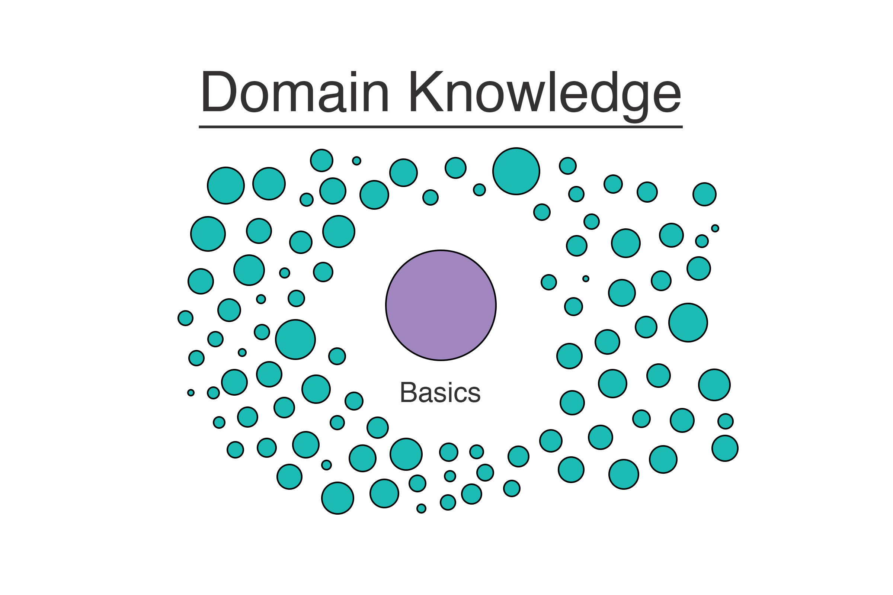

:title: So What's Next?
:author: Paul Logston
:description: Answers to the question "How do I grow as a programmer?"
:keywords: programming, python, intermediate, beginner
:skip-help: true

----

So What's Next
==============

Paul Logston
------------

@PaulLogston

plog.logston.me

----

The Questions I Get
===================

I'm done with *Learn Python the Hard Way*, so what's next?

- What's a good project to build my Python skills?
- What book should I read to become a better Python Programmer?
- What's an intermediate level programmer?

----

Assumptions I Made
==================

- Familiar with the concepts in  *Learn Python the Hard Way* but not much more.

----

Map
===

Where are we?
-------------

.. image:: images/skill_spectrum.jpg
   :width: 800
   :alt: Skill Spectrum

----

Map
===

Where are we?
-------------

First 5% is beginner and last 5% is expert.

.. image:: images/skill_spectrum_adjusted.jpg
   :width: 800
   :alt: Adjusted Skill Spectrum

----

Map
===

Where are we?
-------------

----

Map
===

Where are we?
-------------

----

Map
===

Where are we?
-------------

----

Map
===

Where do we want to be?
-----------------------

----

My Approach to Answering the Question
=====================================

I asked several intermediate to expert level programmers a few questions.

.. image:: images/experts.jpg
   :width: 800
   :alt: Intermediate and Expert Programmers

----

Responses
=========

Describe an intermediate level programmer?
------------------------------------------

- Knows most ``__builtins__``
- Can write clean code.
- Needs less direction than a beginner programmer but more direction than a senior programmer.

----

Responses
=========

What did you do that caused you to grow out of beginnerhood?
------------------------------------------------------------

- Review Code
- Pursue you own projects outside of work projects. 
- Learn on your own.*

* Ask questions 

  * What is more pythonic?
  * What's easier to maintain and why?
  * What would perform better?

----

My Perspective
==============

Where to go from here?
----------------------

- Create a project for your self that will stretch your skill set.
- Review code and get your code reviewed (Reviewing Buddy)

----

BIG THANKS
==========

Many many thanks to everyone I interviewed for this talk. 

.. image:: images/experts.jpg
   :width: 800
   :alt: Intermediate and Expert Programmers

