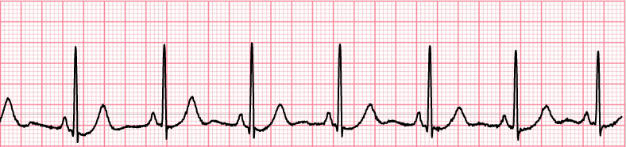

:title: The Graph To My Hearduino
:author: Paul Logston
:description: A look at wrapping the olimex EKG shield with Python
:keywords: ekg, arduino, olimex, emg, python
:skip-help: true

----

The Graph To My Heardunio
=========================

Paul Logston
------------

|twitter_logo| ....... `@paullogston <https://twitter.com/PaulLogston>`_

.. |twitter_logo| image:: images/twitter-4096-black.png
   :width: 20
   :alt: Twitter Handle

**W^3** ... `plog.logston.me <https://plog.logston.me>`_

----

TOC
===

- Intro
- Table of Contents
- EKG Theory (a crash course)
- Olimex Shield + Arduino
- Code for the Olimex Shield
- Python Wrapper (Olimex-EKG-EMG)
- Usage and Comparison to Real Defibrillator
- Live Demo
- Analysis
- Questions & Thank Yous

----

EKG Theory
==========

Crash Course
------------

|ekg_fast|

----

EKG Theory
==========

Crash Course
------------

|ekg_nsr|  

----

EKG Theory
==========

Crash Course
------------

|ekg_graph|

----

Building It
===========

|arduino|   |olimex_shield|

.. |arduino| image:: images/arduino.jpg
   :alt: https://www.arduino.cc/
   :height: 200

- $7 dollar Arduino
- $50 shield
- $20 leads
- $5 red dots
- **$82** TOTAL

----

Writing It
==========

Olimex Shield Output
--------------------

It streams packets that it builds at ``SAMPLE_FREQUENCY`` (125 hz)

::

  //Read the 6 ADC inputs and store current values in Packet
  for(CurrentCh=0;CurrentCh<6;CurrentCh++){
    ADC_Value = analogRead(CurrentCh);
    // Write High Byte
    TXBuf[((2*CurrentCh) + HEADERLEN)] = ((unsigned char)((ADC_Value & 0xFF00) >> 8));
    // Write Low Byte
    TXBuf[((2*CurrentCh) + HEADERLEN + 1)] = ((unsigned char)(ADC_Value & 0x00FF));
  }

  // Send Packet
  for(TXIndex=0;TXIndex<17;TXIndex++){
      Serial.write(TXBuf[TXIndex]);
  }

----

Writing It
==========

Olimex Shield Output
--------------------

::

    struct Olimexino328_packet
    {
      uint8_t       sync0;          // = 0xa5
      uint8_t       sync1;          // = 0x5a
      uint8_t       version;        // = 2 (packet version)
      uint8_t       count;          // packet counter. Increases by 1 each packet.
      uint16_t      data[6];        // 10-bit sample (= 0 - 1023) in big endian.
      uint8_t       switches;       // State of PD5 to PD2, in bits 3 to 0.
    };

----

Writing It
==========

PySerial
--------

|logo|

.. |logo| image:: images/pyserial.png
  :alt: http://pyserial.sourceforge.net/
  :class: pyserial-logo
  :width: 600

----

Writing It
==========

PySerial
--------

|bowl|

----

Writing It
==========

Reading From Serial Port
------------------------

::

    class PacketStreamReader:
       def __init__(self, serial):
            self._serial = serial

        def _get_next_packet(self):
            byte0, byte1 = 0, 0

            while byte0 != SYNC0 or byte1 != SYNC1:
                # If we don't have enough data to do ALL of the following,
                # return None.
                #   - Move current byte 1 into byte0 position
                #   - Read a new byte into byte1  (1 byte)
                #   - Read the rest of a packet into a buffer (PACKET_SIZE - 2 bytes)
                # We need at least (PACKET_SIZE - 2) + 1 bytes before
                # attempting to get the next packet.
                in_waiting = self._serial.inWaiting()
                if in_waiting < PACKET_SIZE - 1:
                    return None
                byte0, byte1 = byte1, self._serial.read()

            buff = bytearray()
            buff.append(ord(byte0))
            buff.append(ord(byte1))
            # read 15 more bytes
            buff.extend(self._serial.read(PACKET_SIZE -2))
            return buff

----

Writing It
==========

How to we build broken values?
------------------------------

::

    def calculate_values_from_packet_data(data):
       values = []

        for index in range(0, len(data), 2):
            # byte_a is the most significant byte and byte_b is
            # the least significant byte.
            byte_a, byte_b = data[index], data[index + 1]
            val = (byte_a << 8) | byte_b

            # For some reason the data comes in upside down.
            # Flip data around a horizontal axis.
            val = (val - 1024) * -1

            values.append(val)

        return values

----

Using It
========

at the command line...
----------------------

::

    $ exg -p /dev/tty.usbmodem1411

    $ exg -f mock-data/nsr.bin

|olimex_nsr_video|

----

Using It
========

Compare
-------

[Olimex]
|olimex_nsr|

[Lifepak]
|lifepak_nsr|

.. |olimex_nsr| image:: images/olimex_nsr.png
  :width: 800

.. |lifepak_nsr| image:: images/lifepak_nsr.jpg
  :alt: CPR123, lifepak
  :width: 800

----

Using It
========

Compare
-------

|olimex_shield2| |lifepak|

----

Using It
========

Live Demo
---------

Can I get a volunteer?!

|olimex_nsr_video|

----

Analysis
========

- Not medical grade. Nothing but course assessment of patient.
- Time drift (1 second per minute)

----

Thank You
=========

- CPR123 (For the rhythm data)

Interested? More to come in the BOF room
----------------------------------------

Questions?
----------

----

Bibliography
============

[1]
Anatomy & Physiology Online - Cardiac conduction system and its relationship with ECG
Primal Pictures - 3D Human Anatomy
https://www.youtube.com/watch?v=v3b-YhZmQu8

[2]
Medical Training and Simulation LLC

[3]
http://en.ecgpedia.org/wiki/File:ECGpapier.png

[4] CPR123, https://www.cpr123.com/

